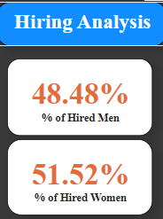
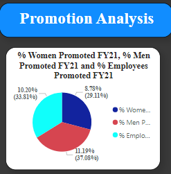

# Diversity and Inclusion Analysis Report

## Introduction

This report provides an in-depth analysis of diversity and inclusion metrics within the organization, based on data collected from the PwC Virtual Internship Program. The focus of the analysis is on key areas such as hiring practices, promotion rates, performance evaluations, and employee turnover, with a particular emphasis on gender representation. The insights derived from this analysis aim to inform strategies for improving diversity and inclusion at all levels of the organization.

## Hiring Analysis

**Observation:** The hiring analysis shows a fairly balanced gender distribution among new hires, with 48.48% being men and 51.52% being women. This indicates that the organization is making significant strides toward gender diversity during the hiring process.

**Insight**: The slightly higher percentage of female hires suggests a positive trend towards achieving gender balance in the workforce.

**Recommendation**: The organization should continue its efforts to maintain this balance by ensuring that hiring practices remain inclusive and unbiased, further promoting gender equality.

## **Promotion Analysis**

Observation: The promotion analysis reveals that 10.20% of women were promoted during FY21, compared to 8.78% of men. Overall, 11.19% of employees received promotions, indicating a slightly higher promotion rate for women.

**Insight:** This reflects an equitable approach to career advancement, where women are being recognized and promoted at slightly higher rates than men, contributing to gender diversity at higher organizational levels.

**Recommendation:** To sustain and further this equity in promotions, the organization should consider implementing mentorship programs that support career development for underrepresented groups, particularly women, to ensure continued gender balance in leadership roles.

## **Performance Analysis**

Observation: The performance analysis shows that the average performance ratings for men and women are almost identical, with men averaging 2.40 and women 2.39. This indicates that performance evaluations are conducted fairly and without significant gender bias.

**Insight:** The nearly equal performance ratings between genders demonstrate that the organization is successfully maintaining an unbiased performance evaluation process.

**Recommendation:** The organization should continue to monitor performance evaluations to ensure that this parity is maintained, and consider conducting regular bias training for evaluators to reinforce objective assessment standards.

## **Turnover Analysis**

**Observation:** The turnover analysis indicates a higher overall turnover rate of 18.7%, with 26 male and 21 female employees leaving the organization in FY20. The number of men leaving the organization slightly outpaces that of women.

**Insight:** The higher turnover rate among male employees suggests potential underlying issues that may be contributing to dissatisfaction or disengagement among this group.

**Recommendation:** The organization should investigate the root causes of this higher male turnover, potentially through employee surveys or exit interviews, to develop targeted retention strategies that address these issues. Initiatives could include enhanced career development opportunities, recognition programs, or work-life balance improvements tailored to male employees' needs.

## **Conclusion**

The analysis of diversity and inclusion metrics within the organization highlights areas of strength, such as balanced hiring practices and equitable promotion processes, while also identifying opportunities for improvement, particularly in reducing male turnover. By implementing the recommended strategies, the organization can continue to foster an inclusive and supportive work environment that promotes diversity at all levels.

